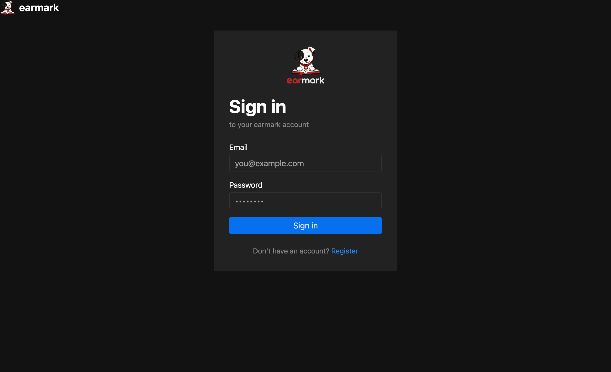
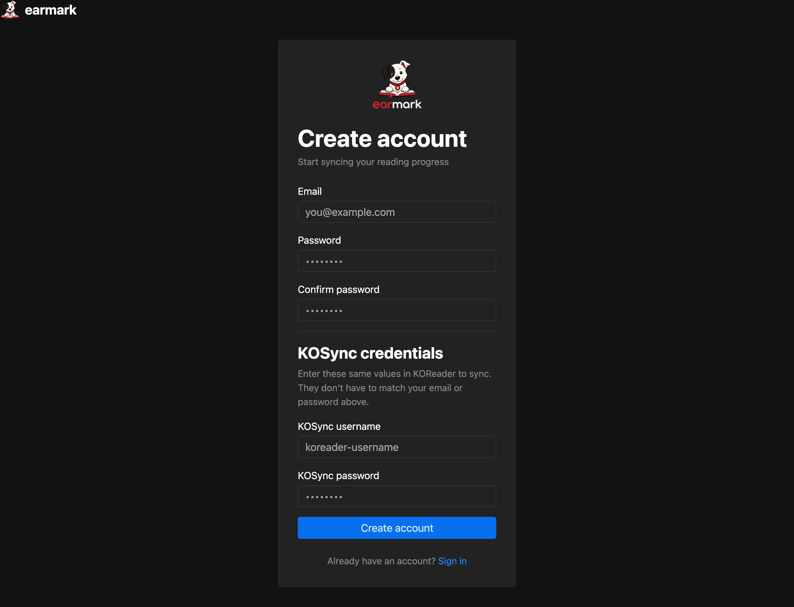
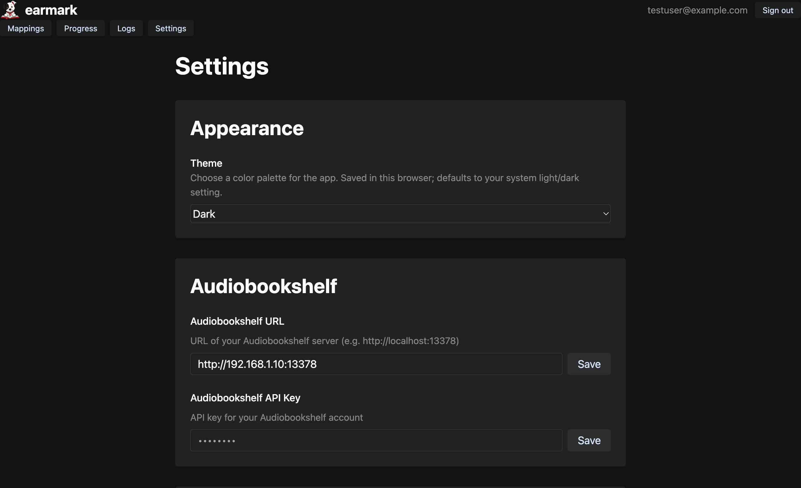
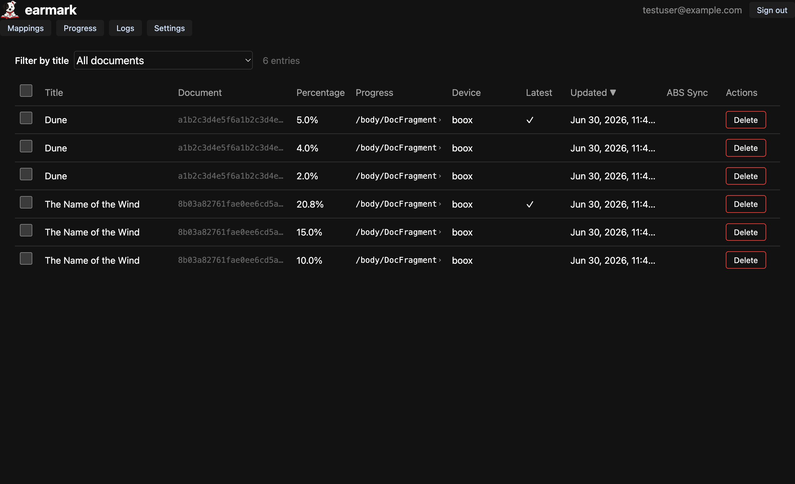

# Homelab Setup Guide

This guide walks you through running **earmark** on a home server and syncing your
reading progress between [Audiobookshelf](https://www.audiobookshelf.org/) and
[KOReader](https://koreader.rocks/). It uses **prebuilt Docker images**, so you don't
need to clone the repository or build anything from source.

> New to earmark? See the [README](../README.md) for what it does and how it works.

## How it runs

`docker compose` starts three small containers behind a single port:

| Container | Role |
|---|---|
| `earmark-backend` | FastAPI app — the KOSync server, the ABS ↔ KOSync sync scheduler, and the web API |
| `earmark-frontend` | The SvelteKit web UI |
| `earmark-nginx` | Reverse proxy that puts the UI, the web API (`/api`), and the KOSync API (`/syncs`) on one port |

All data — the SQLite database and the alignment cache — lives in a Docker named volume
(`earmark-data`), so it survives restarts and updates.

## Prerequisites

- A Linux host (any machine on your LAN — a NAS, a mini PC, a VM) with
  [Docker](https://docs.docker.com/get-docker/) and Compose v2 (`docker compose`).
- A running **Audiobookshelf** instance reachable from that host.
- An **Audiobookshelf API key**. In Audiobookshelf, go to
  **Settings → Users**, open your user, and copy the **API Token** (or create a dedicated
  API key under **Settings → API Keys** on newer versions). You'll paste this into earmark.

---

## Step 1 — Create a directory and an `.env` file

Pick a directory on the server to hold earmark's configuration:

```bash
mkdir -p ~/earmark && cd ~/earmark
```

Create an `.env` file next to where the compose file will live:

```bash
# Sign JWTs — generate a strong random value:
#   python3 -c "import secrets; print(secrets.token_urlsafe(48))"
SECRET_KEY=replace-with-a-long-random-string

# Your Audiobookshelf server (use the host's LAN IP or hostname, not localhost)
AUDIOBOOKSHELF_URL=http://192.168.1.10:13378
AUDIOBOOKSHELF_API_KEY=paste-your-abs-api-key-here

# The address you'll open earmark at. MUST match how you reach it in the browser,
# or login cookies will be rejected.
PORT=7070
ORIGIN=http://192.168.1.20:7070

# Optional
SYNC_INTERVAL_SECONDS=300         # how often to sync (seconds)
TIMEZONE=America/New_York         # IANA name — only affects how the UI displays times
```

> **`ORIGIN` is the setting people get wrong.** It must be the exact scheme + host + port
> you type into your browser to reach earmark — e.g. `http://192.168.1.20:7070`. If it
> doesn't match, you'll be able to load the page but logins silently fail because the
> session cookie is dropped.

The full list of variables is documented in
[`.env.example`](../.env.example) and [`docker/DOCKER.md`](../docker/DOCKER.md).

## Step 2 — Create `docker-compose.yml`

In the same directory, create a `docker-compose.yml` that pulls the prebuilt images from
GitHub Container Registry (GHCR):

```yaml
services:
  backend:
    image: ghcr.io/rmontgomery2018/earmark-backend:latest
    container_name: earmark-backend
    env_file: .env
    environment:
      DATABASE_URL: sqlite+aiosqlite:////app/data/earmark.db
      ALIGNMENT_CACHE_DIR: /app/data/cache
    volumes:
      - earmark-data:/app/data
    restart: unless-stopped

  frontend:
    image: ghcr.io/rmontgomery2018/earmark-frontend:latest
    container_name: earmark-frontend
    env_file: .env
    environment:
      BACKEND_URL: http://backend:7700
      ORIGIN: ${ORIGIN:-http://localhost:7070}
    depends_on:
      - backend
    restart: unless-stopped

  nginx:
    image: nginx:alpine
    container_name: earmark-nginx
    ports:
      - "${PORT:-7070}:80"
    volumes:
      - ./nginx.conf:/etc/nginx/nginx.conf:ro
    depends_on:
      - frontend
      - backend
    restart: unless-stopped

volumes:
  earmark-data:
```

The nginx container needs a config file that isn't baked into the images. Download it next
to your compose file:

```bash
curl -fsSL -o nginx.conf \
  https://raw.githubusercontent.com/rmontgomery2018/earmark/main/docker/nginx.conf
```

Your directory should now contain three files:

```
~/earmark/
├── .env
├── docker-compose.yml
└── nginx.conf
```

## Step 3 — Start earmark

```bash
docker compose up -d
```

On first boot the backend automatically creates the database and runs all migrations.
Watch the logs until it settles:

```bash
docker compose logs -f
```

Then open earmark in your browser at the address you set in `ORIGIN` (e.g.
`http://192.168.1.20:7070`). You should see the sign-in page:



## Step 4 — Register the first account

Click **Register**. earmark has two linked identities, and you set both here:

- **Email + password** — your login for the web app.
- **KOSync username + password** — the credentials you'll enter in KOReader. These are
  **separate** from your email/password and are what ties your KOReader device to earmark.



> Why two sets of credentials? See
> [`docs/RegistrationKosyncLinking.md`](RegistrationKosyncLinking.md) for the design and
> how earmark adopts an existing standalone KOSync user if the password matches.

## Step 5 — Confirm your Audiobookshelf connection

Sign in, then open the **Settings** tab. The values from your `.env` are shown here; confirm
the **Audiobookshelf URL** and **API Key** are correct, and adjust the **Sync Interval** if
you like. Settings saved here are stored in the database and take effect without a restart.



## Step 6 — Point KOReader at earmark

On your KOReader device, install/enable the **KOSync** plugin, then configure a custom sync
server:

- **Custom sync server**: `http://192.168.1.20:7070` (your `ORIGIN`)
- Log in with the **KOSync username and password** you chose during registration.

KOReader talks to earmark over the `/syncs` path, which nginx proxies to the backend — you
don't need to add it to the URL. For the full protocol reference, see
[`docs/KosyncApi.md`](KosyncApi.md).

## Step 7 — Verify a sync

Read a bit in KOReader (or play the matching audiobook in Audiobookshelf), wait for a sync
cycle, then open the **Progress** tab. You'll see your reading positions, which device they
came from, and whether they've been synced to Audiobookshelf.



For how progress is matched and pushed in both directions, see [`docs/Sync.md`](Sync.md).

---

## Operations

### Updating

Pull the latest images and recreate the containers — your data is untouched:

```bash
cd ~/earmark
docker compose pull
docker compose up -d
```

### Backups

Everything is in the `earmark-data` volume. Back it up by copying the SQLite database out
of the running backend container:

```bash
docker compose cp backend:/app/data/earmark.db ./earmark-backup.db
```

### Stopping

```bash
docker compose down       # stop the containers, keep your data
docker compose down -v    # stop AND delete the earmark-data volume (irreversible)
```

### Troubleshooting

| Symptom | Likely cause |
|---|---|
| Page loads but login does nothing / logs you straight back out | `ORIGIN` doesn't match the URL you're using. Fix it in `.env` and `docker compose up -d`. |
| No progress syncing from Audiobookshelf | Wrong `AUDIOBOOKSHELF_URL` or `AUDIOBOOKSHELF_API_KEY`; check the Settings tab and the Logs tab. |
| KOReader can't connect | Confirm the custom sync server is `http://<server>:<PORT>` and the KOSync username/password match what you registered. |

The **Logs** tab (and the on-disk log files) show sync activity and errors — see
[`docs/LogsTab.md`](LogsTab.md).

---

## Optional: HTTPS / reverse proxy

If you put earmark behind a reverse proxy (Caddy, Traefik, nginx) with a real domain and
TLS, set `ORIGIN` to that public URL, e.g. `https://earmark.example.com`, so session
cookies are issued for the right origin.

## Building from source instead

If you'd rather build the images yourself from a checkout of the repo (e.g. to run an
unreleased change), use the bundled compose file that builds locally —
see [`docker/DOCKER.md`](../docker/DOCKER.md).
